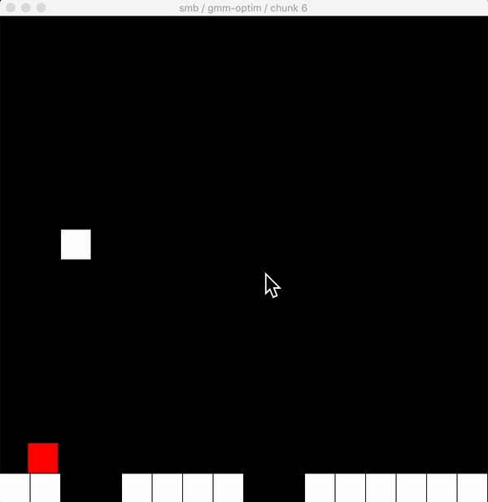

## Demo



## Usage

Run agent on 100 original SMB chunks: `python test_loop.py org`

Run agent on 100 VAE-generated SMB chunks: `python test_loop.py org`

Run agent on 100 (under-fitting) GMM-generated SMB chunks: `python test_loop.py gmm-[components]`

- Components to choose from: [  8,  28,  48,  68,  88, 108, 128]

- E.g., `python test_loop.py gmm-128`

Run agent on 100 (best-fitting) GMM-generated SMB chunks: `python test_loop.py gmm-optim`

## Pygame Compatibility

My Python version is 3.6.9 and my Pygame vesion is 2.0.0.dev3.

You can update your Pygame to this version using: `pip install pygame==2.0.0.dev3`

See this post for discussion: https://github.com/pygame/pygame/issues/555

## Citation

Please cite this project if you use it in your research.

```
@misc{mario-playability-test,
  author = {Zhihan Yang},
  howpublished = {GitHub},
  title = {{M}ario {P}layability {T}est},
  URL = {https://github.com/zhihanyang2022/mario-playability-test},
  year = {2020},
}
```

